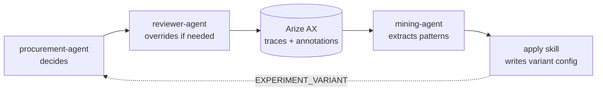
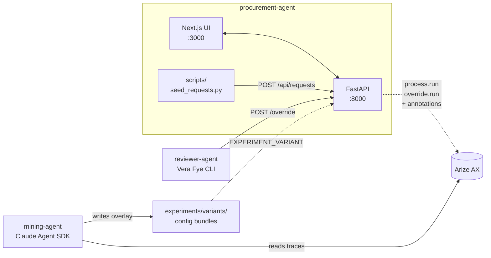
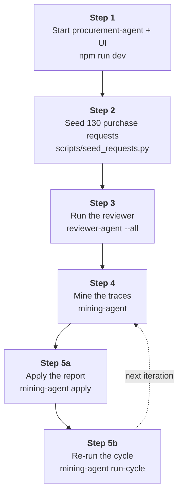
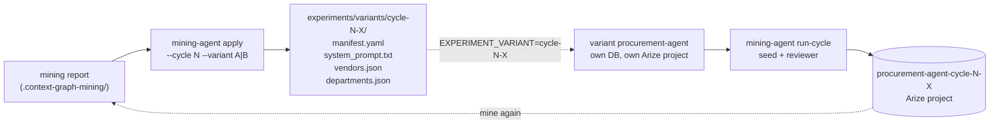

# Building a self-improving agent on a context graph of human disagreement Demo

A self-improving AI loop built around a **context graph** — a structured, queryable record of how an organization actually makes decisions, captured automatically through AI agent runs and human reviews.

Read the blog post: [Building a self-improving agent on a context graph of human disagreement](https://arize.com/blog/self-improving-agent-with-context-graph)


A procurement agent evaluates purchase requests against policy. A simulated human reviewer (Vera Fye, a finance manager with 12 years of institutional knowledge that policy doesn't capture) overrides when needed. Every override produces both a traced agent run and a human-review annotation in [Arize AX](https://arize.com/). A mining agent reads those traces, identifies patterns where the policy-driven agent diverges from the human, and proposes changes that move the agent closer to how the organization actually decides.



---

## Architecture

Three independent components — talk over HTTP and a shared Arize project, never directly:



```
procurement-agent/        # FastAPI agent + Next.js UI + seed script
├── src/                  #   - LangChain agent: check_policy, lookup_vendor, check_budget
├── ui/                   #   - Next.js 16 + React 19 frontend
└── scripts/              #   - 130 synthetic purchase-request inputs

reviewer-agent/           # Vera Fye simulator (Python CLI)
                          #   - Anthropic w/ a markdown file of institutional knowledge
                          #   - Idempotent; runs in parallel against the agent's /override

mining-agent/             # Mining + cycle orchestration (Claude Agent SDK)
                          #   - Uses Claude skills at .claude/skills/context-graph-{mining,apply}/
                          #   - Reads traces, writes report; optionally applies as runtime config
```

---

## What ends up in Arize

| Run | Trace | Annotation |
|---|---|---|
| Create request (`POST /api/requests`) | `process.run` (CHAIN root + tool calls + LLM) | — |
| Manual /process (`POST /api/requests/{id}/process`) | `process.run` | — |
| Reviewer override (`POST /api/requests/{id}/override`) | `override.run` (re-runs the agent with the reviewer's input embedded) | Reviewer Decision + Confidence + Name + freeform notes (reasoning, precedent, conditions) attached to the override root span |

Traces are grouped by `session.id = request.id`, so every run for a given purchase request groups into one Arize session.

---

## Prerequisites

| | |
|---|---|
| Python 3.12 + `uv` | `brew install uv` |
| Node 20+ + `npm` | for the UI |
| Anthropic API key | the agent, reviewer, and mining-agent all use it |
| Arize AX account | for tracing + annotations |
| `ax` CLI (optional but recommended) | `pipx install arize-ax-cli`, then `ax profiles create` |

Copy the template and fill in your values:

```bash
cp .env.example .env
# edit .env — ANTHROPIC_API_KEY, ARIZE_API_KEY, ARIZE_SPACE_ID
```

The Python apps (`procurement-agent`, `reviewer-agent`, `mining-agent`, and `procurement-agent/scripts`) autoload the repo-root `.env` on startup via `python-dotenv`, regardless of which directory you run them from. Variables set in your shell take precedence over the file.

For the UI:

```bash
cp procurement-agent/ui/.env.local.example procurement-agent/ui/.env.local
```

`.env.local` is optional — defaults work when the agent runs on `localhost:8000`.

---

## The end-to-end flow



---

## 1. Prepare and run the procurement agent + UI

The agent + UI live in one folder so they can be developed and run together.

```bash
# Install Python deps for the agent
cd procurement-agent
uv sync

# Install UI deps
cd ui && npm install && cd ..

# Seed reference data (departments / vendors / policies) — fresh SQLite each time
uv run python -m src.seed_data
```

Start both processes together (from the repo root):

```bash
cd ..
npm run dev
```

That spawns the agent on `http://localhost:8000` and the UI on `http://localhost:3000`. Both auto-reload on file changes.

---

## 2. Run the seed script — process 130 purchase requests

The seed script POSTs 130 deterministic synthetic requests through the running agent. Each one auto-processes — the agent decides on the spot — and lands in Arize as a `process.run` trace.

```bash
cd procurement-agent/scripts
uv sync
uv run python seed_requests.py
```

Defaults to `http://localhost:8000`, concurrency 10. Configurable via:

- `PROCUREMENT_AGENT_URL` (default `http://localhost:8000`)
- `SEED_PARALLELISM` (default 10)
- `SEED_TIMEOUT_SECONDS` (default 180)

A run takes ~2 minutes.

---

## 3. Run the reviewer agent — Vera reviews every assessment

Vera reads each agent assessment and either confirms or overrides. Every override sends the decision back through `POST /api/requests/{id}/override`, which re-runs the agent with Vera's reasoning embedded — producing a fresh `override.run` trace plus annotations on its root span.

```bash
cd reviewer-agent
uv sync
uv run python -m src --all --parallel 10
```

- `--all` reviews every request whose latest assessment is unreviewed.
- `--parallel 10` runs 10 reviews concurrently (sequential by default).
- Idempotent: re-running skips PRs that already have a final review.

Takes ~3 minutes at `parallel=10`.

After this, the Arize project `procurement-agent` has 130 process runs + 130 override runs with annotations — the raw substrate the mining agent will read.

---

## 4. Run the mining agent — extract patterns + propose changes

The mining agent is a [Claude Agent SDK](https://docs.claude.com/en/api/agent-sdk/overview) wrapper around two Claude Code skills:

- `.claude/skills/context-graph-mining/` — reads traces + annotations, identifies clusters where the agent and reviewer diverge, proposes changes.
- `.claude/skills/context-graph-apply/` — translates the mining report into a runtime config bundle the agent can load without source-code changes.

You'll need a [Claude API key](https://console.anthropic.com/) or to be running inside Claude Code (which provides auth automatically).

```bash
cd mining-agent
uv sync
uv run python -m src                          # mines the procurement-agent project
```

The output is a markdown report saved to `.context-graph-mining/report-<timestamp>.md` describing:

- Cluster breakdowns (agent says X, reviewer says Y for which vendor / department / amount pattern)
- Precedent tags Vera cites repeatedly (institutional knowledge)
- Concrete proposed diffs against runtime config (vendor metadata, department behavior notes, prompt fragments)
- Out-of-scope items the mining agent flags for human decision

To target a specific project (e.g. after applying a variant — see step 5):

```bash
uv run python -m src --project procurement-agent-cycle-1-B
```

---

## 5. Improve the procurement agent — apply, re-run, mine again

The procurement-agent supports **runtime parameterization** through an `EXPERIMENT_VARIANT` env var. When set, the agent loads a config bundle from `experiments/variants/<id>/` on startup — pure additive config, no source modification. The mining report's proposals translate cleanly into these bundles.



### Apply the mining report's proposals

```bash
cd mining-agent
uv run python -m src apply --cycle 1 --variant A      # prompt-only overlay
uv run python -m src apply --cycle 1 --variant B      # prompt + structured metadata
```

Two variants per cycle:

- **A**: prompt-only — appends reviewer-cited rules to the evaluator's system prompt. Cheapest, reversible, tests "does the LLM read the new instruction?"
- **B**: prompt + structured metadata — additionally writes `vendors.json` + `departments.json` overlays that the agent reads through `lookup_vendor` and `lookup_department`. Tests whether structured-data delivery beats prose.

The output lands in `experiments/variants/cycle-N-X/` with a `manifest.yaml` citing the evidence sessions for each change.

### Run a full cycle against the variant

```bash
uv run python -m src run-cycle --cycle 1 --variant A
uv run python -m src run-cycle --cycle 1 --variant B
```

`run-cycle` orchestrates the whole flow:

1. Bootstraps a per-variant SQLite DB (`procurement-agent/data/procurement-cycle-1-A.db`).
2. Spawns the variant procurement-agent on port 8001 with `EXPERIMENT_VARIANT=cycle-1-A` set — its traces land in a separate Arize project `procurement-agent-cycle-1-A`.
3. Runs the seed script against it.
4. Runs the reviewer against it.
5. Tears down the variant agent.

After both variants land, mine each project:

```bash
uv run python -m src --project procurement-agent-cycle-1-A
uv run python -m src --project procurement-agent-cycle-1-B
```

The new reports compare cycle 1 to baseline and propose cycle-2 changes. Repeat.

### Manual alternative

You can also run a variant agent directly without `run-cycle`:

```bash
cd procurement-agent
EXPERIMENT_VARIANT=cycle-1-A uv run python -m src.seed_data          # seeds the variant DB
EXPERIMENT_VARIANT=cycle-1-A uv run uvicorn src.main:app --port 8001
```

Then point `seed_requests.py` and `reviewer-agent` at port 8001 with `PROCUREMENT_AGENT_URL=http://localhost:8001`.

---

## Project layout

```
.
├── procurement-agent/       # FastAPI agent + Next.js UI + seed scripts
│   ├── pyproject.toml       #   Python: FastAPI, LangChain, Arize OTel, Anthropic
│   ├── src/                 #   Models, DB, agent pipeline, instrumentation
│   ├── tests/               #   127 tests (unit + integration)
│   ├── ui/                  #   Next.js 16 + React 19 + Tailwind v4
│   └── scripts/             #   Synthetic data + parallel seed
├── reviewer-agent/          # Vera Fye simulator (CLI)
│   ├── pyproject.toml
│   ├── src/                 #   reviewer.py (system prompt with institutional knowledge)
│   └── tests/               #   8 tests
├── mining-agent/            # Mining + apply + cycle orchestration
│   ├── pyproject.toml       #   Python: claude-agent-sdk, httpx, pydantic
│   ├── src/                 #   runner.py (mining), apply_runner.py, run_cycle.py, variant_server.py
│   └── tests/               #   21 tests
├── .claude/skills/          # Claude Code skills (load when cwd = this repo)
│   ├── context-graph-mining/
│   └── context-graph-apply/
├── experiments/variants/    # Variant config bundles (gitignored — generated by `apply`)
├── docs/                    # Spec, agent-team notes, source material (some gitignored)
└── package.json             # Top-level npm run dev (agent + UI together)
```

---

## Tech stack

| Component | Stack |
|---|---|
| `procurement-agent` | Python 3.12, FastAPI, [LangChain](https://www.langchain.com/) 1.x, SQLite, [Arize OTel](https://arize.com/) + [OpenInference](https://github.com/Arize-ai/openinference) LangChain instrumentor, [Anthropic](https://www.anthropic.com/) Claude Haiku 4.5 |
| `procurement-agent/ui` | Next.js 16, React 19, Tailwind CSS v4, TypeScript |
| `reviewer-agent` | Python 3.12, [Anthropic](https://www.anthropic.com/) SDK with tool-use structured output, httpx |
| `mining-agent` | Python 3.12, [Claude Agent SDK](https://docs.claude.com/en/api/agent-sdk/overview), Claude Code skills, httpx |
| Tracing | [Arize AX](https://arize.com/) via OpenInference, sessions tagged `session.id = request.id` |
| Tests | pytest, 156 total across all three apps |

---

## License

MIT
